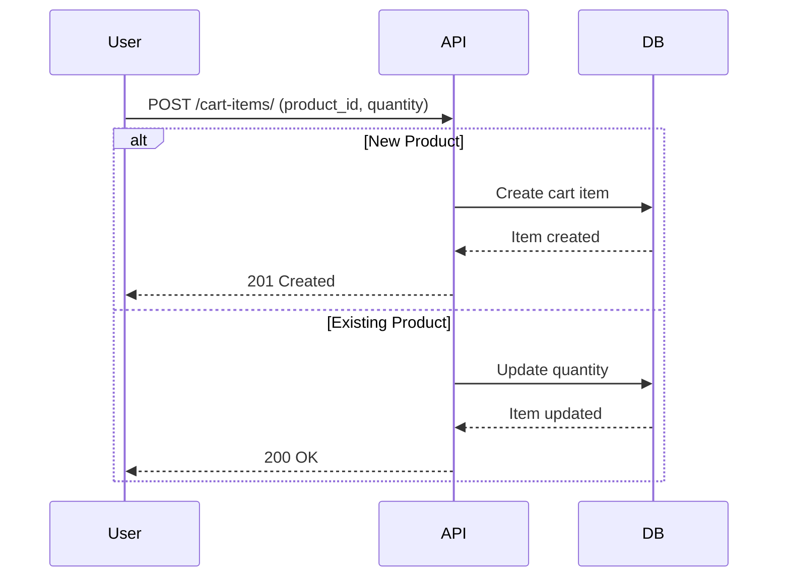
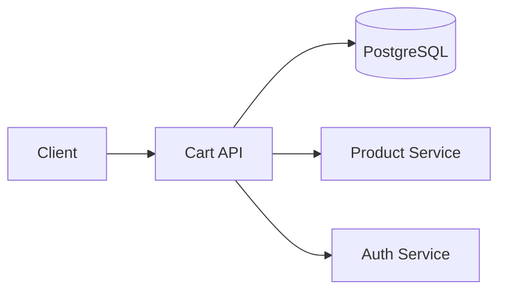

# 🛒 E-Commerce Cart Service


## 📋 Table of Contents
- [Features](#-features)
- [Architecture](#-architecture)
- [API Documentation](#-api-documentation)
- [Testing](#-testing)
- [Security](#-security)

---

## ✨ Features

### Cart Management
| Feature | Endpoint | Description |
|---------|----------|-------------|
| **Get Cart** | `GET /cart/` | Retrieve user's cart with items |
| **Create Cart** | `POST /cart/` | Create new cart (auto-created) |

### Cart Item Operations
| Feature | Endpoint | Description |
|---------|----------|-------------|
| **List Items** | `GET /cart-items/` | Get all items in cart |
| **Add Item** | `POST /cart-items/` | Add/update product in cart |
| **Get Item** | `GET /cart-items/{id}/` | Retrieve specific item |
| **Update Item** | `PUT /cart-items/{id}/` | Modify item quantity |
| **Delete Item** | `DELETE /cart-items/{id}/` | Remove item from cart |

### Security Features
- JWT authentication
- Object-level permissions
- UUID identifiers
- Input validation

---

## 🏗️ Architecture

### Cart Workflow


### Component Relationships


---

## 📡 API Documentation

### Endpoint Reference
| Endpoint | Method | Parameters | Response |
|----------|--------|------------|----------|
| `/cart/` | GET | None | Cart details |
| `/cart-items/` | POST | `product_id`, `quantity` | Item details |
| `/cart-items/{id}/` | PUT | `product_id`, `quantity` | Updated item |
| `/cart-items/{id}/` | DELETE | None | 204 No Content |

**Example Request:**
```http
POST /cart-items/
Authorization: Bearer <token>
Content-Type: application/json

{
  "product_id": "550e8400-e29b-41d4-a716-446655440000",
  "quantity": 2
}
```

**Response:**
```json
{
  "item_id": "b3baa1bb-efd9-4d79-8f36-2a1f86a8a9e7",
  "product": {
    "product_id": "550e8400-e29b-41d4-a716-446655440000",
    "name": "Premium Laptop",
    "unit_price": "1299.99"
  },
  "quantity": 2,
  "get_total_price": 2599.98
}
```

---

## 🧪 Testing
```bash
# Run all tests
python manage.py test cart

# With coverage
pytest --cov=cart --cov-fail-under=95
```

---

## 🔒 Security
- **Authentication**: JWT required
- **Permissions**: Strict ownership checks
- **Validation**: Positive quantities only
- **Data Protection**: UUIDs instead of sequential IDs

---

**📜 License:** MIT  
**🔄 Last Updated:** August 7th, 2025