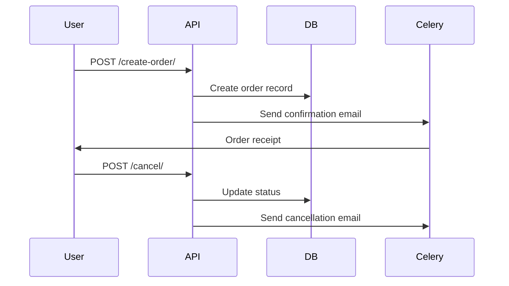
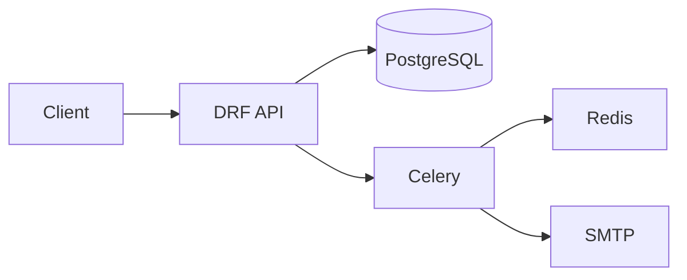

# 🛒 E-Commerce Orders Service


## 📋 Table of Contents
- [Features](#-features)
- [Architecture](#-architecture)
- [API Documentation](#-api-documentation)
- [Testing](#-testing)
- [Security](#-security)

---

## ✨ Features

### Order Management
| Feature | Endpoint | Description |
|---------|----------|-------------|
| **Create Order** | `POST /orders/create-order/` | Convert cart to order |
| **List Orders** | `GET /orders/` | Get user's order history |
| **Order Details** | `GET /orders/{order_id}/` | Get specific order |
| **Cancel Order** | `POST /orders/{order_id}/cancel/` | Cancel pending order |

### Processing Features
- Automatic tax calculation (16%)
- Fixed shipping costs
- Email notifications
- Status tracking

---

## 🏗️ Architecture

### System Flow


### Component Diagram


---

## 📡 API Documentation

### Endpoint Reference
| Endpoint | Method | Parameters | Success Response |
|----------|--------|------------|------------------|
| `POST /orders/create-order/` | POST | `shipping_address` (optional), `billing_address` (optional), `notes` (optional) | `200 OK` with order details |
| `GET /orders/` | GET | None | `200 OK` with orders list |
| `GET /orders/{order_id}/` | GET | None | `200 OK` with order details |
| `POST /orders/{order_id}/cancel/` | POST | None | `200 OK` with cancellation confirmation |

**Example Order Creation:**(shows optional fields too)
```http
POST /orders/create-order/
Content-Type: application/json
Authorization: Bearer <token>

{
  "shipping_address": {
    "street": "123 Main St",
    "city": "Nairobi"
  },
  "billing_address":{
    ...
  },
  "notes": "..."
}
```

**Response:**
```json
{
    "success": {
        "order_id": "dac37062...",
        "order_number": "D50C...",
        "user": "6f8de158...",
        "status": "pending",
        "payment_status": "unpaid",
        "subtotal": "501000.00",
        "tax_amount": "80160.00",
        "shipping_cost": "300.00",
        "total_amount": "581460.00",
        "shipping_address": null,
        "billing_address": null,
        "notes": "",
        "created_at": "2025-08-07...",
        "order_items": [
            {
                "item_id": "c57bd80c-3ab3-4543...",
                "order": "dac37062-3dda....",
                "product": "b94faf28-2063-4371....",
                "product_name": "HP-revolve",
                "quantity": 10,
                "price_per_item": "50000.00",
                "total_price": "500000.00",
                "created_at": "2025-08..."
            },
            {
                "item_id": "6c3284b6...",
                "order": "dac37062...",
                "product": "8a448bce...",
                "product_name": "Dell",
                "quantity": 10,
                "price_per_item": "100.00",
                "total_price": "1000.00",
                "created_at": "2025-08-07..."
            }
        ]
    }
}
```

---

## 🧪 Testing
```bash
# Run all tests
python manage.py test orders

# Run tests with coverage
pytest --cov=orders --cov-fail-under=90
```

---

## 🔒 Security
- **User Isolation**: Users can only access their own orders
- **Cancellation Rules**: Only pending orders can be cancelled
- **Data Protection**: UUID primary keys for all models
- **Transaction Safety**: Atomic database operations

---

**📜 License:** MIT  
**🔄 Last Updated:** August 8th, 2025
