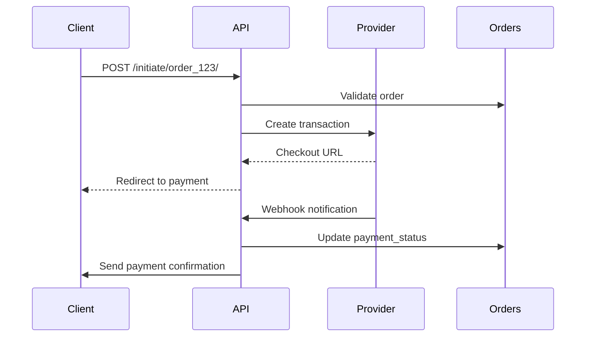
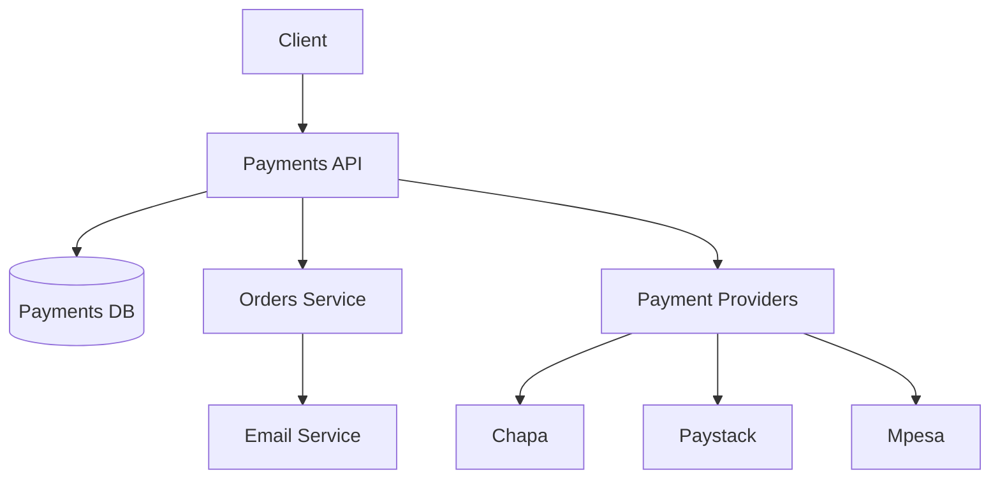
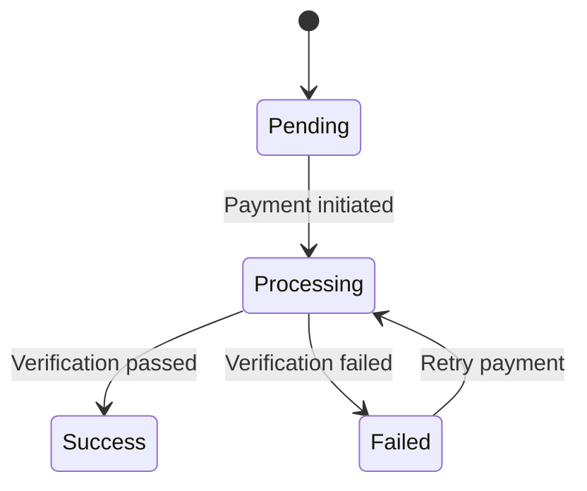

# 💳 Payments Service

 


## 📋 Table of Contents
- [Features](#-features)
- [Architecture](#-architecture)  
- [API Documentation](#-api-documentation)
- [Payment Flow](#-payment-flow)
- [Testing](#-testing)
- [Security](#-security)

---

## ✨ Features

### Core Payment Processing
| Feature | Endpoint | Description |
|---------|----------|-------------|
| **Initiate Payment** | `POST /payments/initiate/<order_id>/` | Start payment flow |
| **Payment Verification** | `GET/POST /payments/verify/<provider>/` | Handle payment confirmation |
| **Payment History** | `GET /payments/` | View user's payment records |

### Supported Providers
| Provider | Currencies | Payment Methods |
|----------|------------|-----------------|
| **Chapa** | ETB | Cards, Bank Transfer |
| **Paystack** | USD, EUR | International Cards  (coming soon...)|
| **Mpesa** | KES | Mobile Money (coming soon...) |
| **Cash** | Any | On Delivery |

---

## 🏗️ Architecture

### Payment Sequence


### Component Relationships


---

## 📡 API Documentation

### Key Endpoints
| Endpoint | Method | Parameters | Success Response |
|----------|--------|------------|------------------|
| `POST /payments/initiate/<uuid:order_id>/` | POST | `provider` (required) | `200 OK` with checkout URL |
| `GET /payments/verify/<provider>/` | GET | `trx_ref` (required) | `302 Redirect` |
| `POST /payments/verify/<provider>/` | POST | Webhook payload | `200 OK` |

**Example Payment Initiation:**
```http
POST /payments/initiate/dac37062-3dda-4f3a-9cb7-2e4b7f5c8f9c/
Content-Type: application/json
Authorization: Bearer <token>

{
  "provider": "chapa"
}
```

**Success Response:**
```json
{
  "checkout_url": "https://checkout.chapa.co/pay/xyz123",
  "payment_id": "a1b2c3d4-5678-90ef-ghij-klmnopqr"
}
```

**Webhook Payload Example (Chapa):**
```json
{
  "tx_ref": "payment-ref-123",
  "status": "success",
  "amount": 1000.00
}
```

---

## 🔄 Payment Flow

1. **Initiation**
   - User selects payment method
   - System creates payment record with unique transaction reference
   - Redirects to provider's checkout page

2. **Processing**  
   - User completes payment on provider's platform
   - Provider sends verification to our webhook

3. **Completion**
   - System validates payment
   - Updates order status (paid/failed)
   - Triggers order processing email

**Status Transitions:**


---

## 🧪 Testing
```bash
# Run all tests
python manage.py test payments

# Generate coverage report
coverage run -m pytest && coverage html
```

**Key Test Cases:**
- Payment state transitions
- Provider API error handling
- Webhook verification security
- Concurrent payment attempts
- Order-Payment synchronization

---

## 🔒 Security

### Protection Mechanisms
- **Idempotent Operations**: 
  ```python
  if payment.status == "success":
      return Response({"error": "Payment already processed"}, status=400)
  ```
- **Data Isolation**:
  ```python
  Payment.objects.filter(user=request.user)
  ```
- **Webhook Validation**:
  - Signature verification
  - Transaction reference matching
- **Atomic Operations**:
  ```python
  with transaction.atomic():
      payment.save()
      order.save()
  ```

---

**📜 License:** MIT  
**🔄 Last Updated:** August 2025
