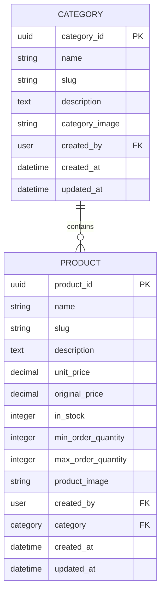

# 🛒 Products & Categories API (Django + DRF)

This app handles all logic related to **product listings** and **product categories** for an eCommerce platform. It supports CRUD operations, image uploads, admin-only write access, and robust validation — fully powered by Django REST Framework (DRF).

---

## 📦 Core Features

### 🔹 Categories
- Create, update, list, and delete product categories.
- Fields:
  - `name` (unique)
  - `description` (optional)
  - `category_image` (optional)
  - `slug` (auto-generated from name)
  - `created_by` (admin user)
  - `is_active`, `created_at`, `updated_at`

### 🔹 Products
- Create and manage individual products under a category.
- Slugs are **auto-generated** and made **unique globally** (e.g., `macbook`, `macbook-1`).
- Same product name allowed **only across users**, not within the same user.
- Fields:
  - `name`, `description`
  - `unit_price`, `original_price`
  - `in_stock`, `min_order_quantity`, `max_order_quantity`
  - `product_image` (optional)
  - `category`, `created_by`, `slug`
  - `featured`, `created_at`, `updated_at`

---

## 🔐 Permissions

| Action         | Admins        | Authenticated Users | Anonymous Users |
|----------------|---------------|----------------------|------------------|
| List / Retrieve | ✅ Yes        | ✅ Yes               | ✅ Yes           |
| Create / Update / Delete | ✅ Yes | ❌ No              | ❌ No           |

Implemented via custom permission class: `IsAdminOrReadOnly`.

---

## 🧠 Business Logic

- Products with **duplicate names are not allowed per user**.
- Slugs auto-generate from name and append suffix if there's a collision.
- `created_by` auto-assigned based on request user (for both models).
- Unique constraint enforced via `unique_together = ['created_by', 'name']` on `Product`.

---

## 🧪 Testing Coverage

Thorough unit tests implemented with `pytest` + `pytest-django`:

### ✅ Models
- Slug generation
- Uniqueness constraints
- Decimal precision
- Foreign key protection
- Image upload behavior
- Timestamp validation

### ✅ Serializers
- Field validation (required, read-only, types)
- Duplicate product name checks
- Slug exclusion on update
- User context handling

### ✅ ViewSets
- CRUD operations
- Permission testing
- Authenticated/unauthenticated access
- Invalid data / error handling
- Image uploads via API

### ✅ Edge Cases
- Unicode support in names
- Very long descriptions
- Maximum decimal inputs
- Missing optional fields
- Slug collision under concurrent operations

To run tests:
```bash
pytest --cov=products
````

---

## 🛣️ API Endpoints

All endpoints are versionable and accessible via:

| Resource   | Method           | URL                       | Description                    |
| ---------- | ---------------- | ------------------------- | ------------------------------ |
| Categories | GET              | `/api/categories/`        | List all categories            |
| Categories | POST             | `/api/categories/`        | Create a category (admin only) |
| Categories | GET              | `/api/categories/<uuid>/` | Retrieve category              |
| Categories | PUT/PATCH/DELETE | `/api/categories/<uuid>/` | Update/Delete (admin only)     |
| Products   | GET              | `/api/products/`          | List all products              |
| Products   | POST             | `/api/products/`          | Create a product (admin only)  |
| Products   | GET              | `/api/products/<uuid>/`   | Retrieve product               |
| Products   | PUT/PATCH/DELETE | `/api/products/<uuid>/`   | Update/Delete (admin only)     |

---

## 📁 Folder Structure

```
products/
├── models.py
├── serializers.py
├── views.py
├── permissions.py
├── urls.py
└── test_products.py
```

### Database Schema


## 🧱 Dependencies

* Django
* Django REST Framework
* Pillow (for image upload)
* pytest + pytest-django
* coverage

Install with:

```bash
pip install -r requirements.txt
```

---

## ✍️ Authors

* Built with ❤️ by the backend team.

---

## 📄 License

This project is open-sourced under the MIT License.

