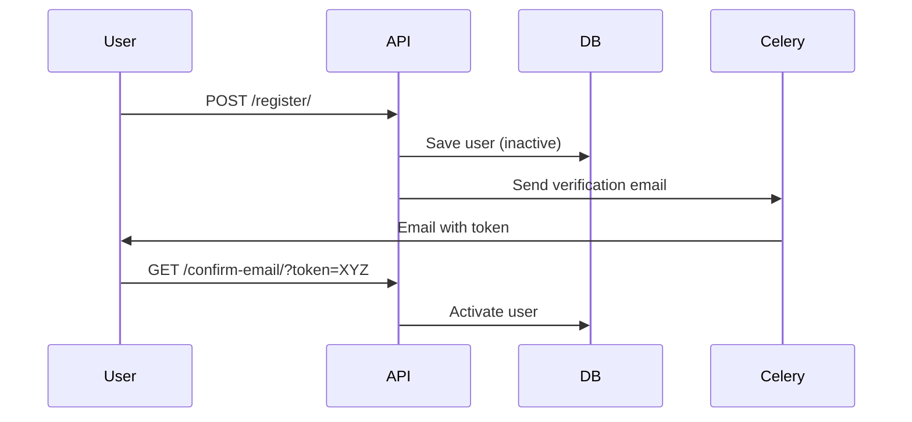
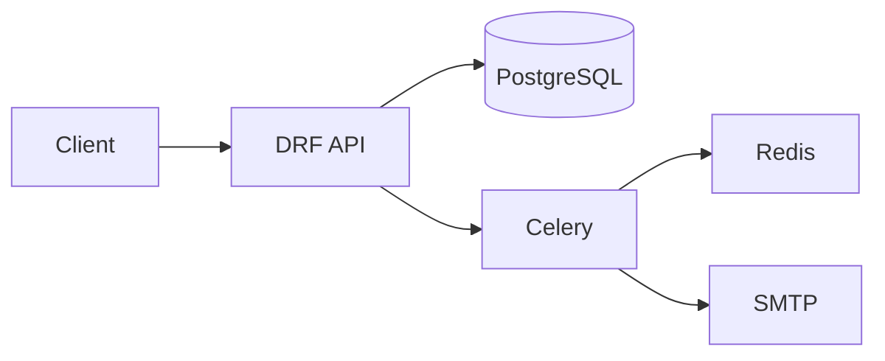

# 🔐 E-Commerce Authentication Service


## 📋 Table of Contents
- [Features](#-features)
- [Architecture](#-architecture)
- [API Documentation](#-api-documentation)
- [Testing](#-testing)
- [Security](#-security)

---

## ✨ Features

### User Management
| Feature | Endpoint | Description |
|---------|----------|-------------|
| **User Registration** | `POST /api/users/register/` | Create new accounts with email verification |
| **Email Verification** | `GET /api/users/confirm-email/` | Confirm email addresses with secure tokens |
| **Resend Activation** | `POST /api/users/resend-activation-email/` | Re-send verification emails |

### Authentication
| Feature | Endpoint | Description |
|---------|----------|-------------|
| **Dual Login** | `POST /api/users/login/` | Login via email OR username |
| **Token Refresh** | `POST /api/users/refresh-session/` | Renew expired access tokens |

### Password Management
| Feature | Endpoint | Description |
|---------|----------|-------------|
| **Password Reset** | `POST /api/users/password-reset/` | Initiate password reset flow |
| **Reset Confirmation** | `POST /api/users/password-reset-confirm/` | Complete password change |

### Security Features
- UUID primary keys
- Rate-limited endpoints
- JWT token encryption
- Soft delete functionality

---

## 🏗️ Architecture

### System Flow


### Component Diagram


---

## 📡 API Documentation

### Endpoint Reference
| Endpoint | Method | Parameters | Success Response |
|----------|--------|------------|------------------|
| `POST /api/users/register/` | POST | `email`, `username`, `password` | `201 Created` |
| `GET /api/users/confirm-email/` | GET | `uid`, `token` | `200 OK` |
| `POST /api/users/login/` | POST | `username`, `password` | JWT tokens |

**Example Login:**
```http
POST /api/users/login/
Content-Type: application/json

{
  "username": "user@example.com",
  "password": "SecurePass123!"
}
```

**Response:**
```json
{
  "access": "eyJhb...",
  "refresh": "eyJhb...",
  "role": "customer"
}
```

---

## 🧪 Testing
```bash
# Run all tests
python manage.py test users

# run tests with coverage
pytest --cov=users --cov-fail-under=90
```

---

## 🔒 Security
- **Password Hashing**: PBKDF2 w/ 20k iterations
- **Token Lifetime**: 30m access, 24h refresh

---

**📜 License:** MIT  
**🔄 Last Updated:** August 2nd, 2025
